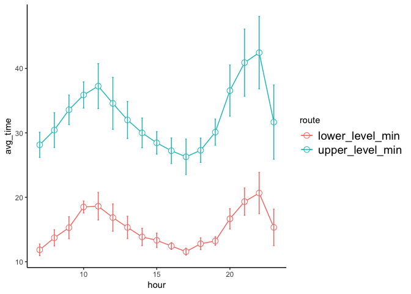
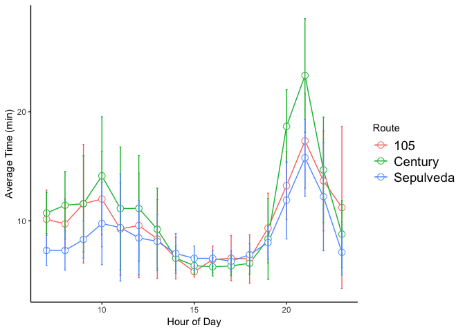
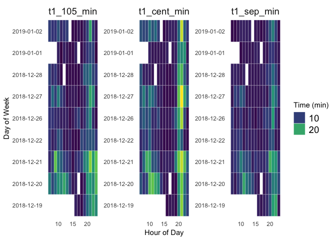

A Tidy Analysis of LAX Holiday Traffic Using Twitter and R
================
Gregory Botwin
06-APR-2019

## Get Data

I decided to get the data once and then save so I wouldn’t hit the
teitter API repeatedly.

``` r
### Get LAX Airport Twitter Timeline, 
##------ Sat Jan 12 18:08:41 2019 ------##
#tl <- get_timeline(user = "flyLAXairport", n = 1000)
#saveRDS(tl, file = "lax_twitter_timeline_jan_12_2019.RData")
tl <- readRDS("lax_twitter_timeline_jan_12_2019.RData")
```

## All Tweets have Similar 9 line Format

``` r
df <- tl %>%
  filter(str_detect(text, "LAX TRAFFIC UPDATE")) %>%
  select(text, created_at) %>%
  separate(text, into = paste0("line", seq(1:9)), sep = "\\n")
```

    ## Warning: Expected 9 pieces. Missing pieces filled with `NA` in 1 rows [71].

This seemed to work well expect for one tweet. Lets investigate further

``` r
df[71,]
```

    ## # A tibble: 1 x 10
    ##   line1 line2 line3 line4 line5 line6 line7 line8 line9 created_at         
    ##   <chr> <chr> <chr> <chr> <chr> <chr> <chr> <chr> <chr> <dttm>             
    ## 1 #LAX… "(As… Uppe… Lowe… Time… - Fr… - Fr… - Vi… <NA>  2018-12-27 01:10:30

This does not seem like it will be a concern because this tweet was just
missing the hashtag. Usually I am stickler, this time I am okay without.

## Extract Text

``` r
df <- df %>%
  mutate(created_at = with_tz(created_at, Sys.timezone())) %>%
  mutate(as_of = as.integer(str_extract(line2, "\\d+"))) %>%
  mutate(am_pm = str_extract(line2, "AM|PM")) %>%
  mutate(upper_level_min = as.integer(str_extract(line3, "\\d+"))) %>%
  mutate(lower_level_min = as.integer(str_extract(line4, "\\d+"))) %>%
  mutate(t1_sep_min = as.integer(str_extract(line6, "\\d+"))) %>%
  mutate(t1_cent_min = as.integer(str_extract(line7, "\\d+(?= min?)"))) %>%
  mutate(t1_105_min = as.integer(str_extract(line8, "\\d+(?= min?)")))
```

This only extract the hour. This is fine and perhaps ideal . Assuming
min. I think is reasonable.

### Add Some Useful Parameters and Tidy

``` r
df <- df %>%
  mutate(day_of_wk = lubridate::wday(created_at, label = TRUE)) %>%
  mutate(day = date(created_at)) %>%
  mutate(hour = hour(created_at))%>%
  select(day_of_wk, day, hour, upper_level_min, lower_level_min, t1_sep_min,
         t1_cent_min, t1_105_min, created_at) %>%
  gather(key = "route", value = "time",-day_of_wk, -day, -hour, -created_at)
```

## Explore Data

``` r
## look at number od days in dataset and observations per day
df %>%
  count(day) %>%
  kable() %>%
  kable_styling(bootstrap_options = "striped", full_width = F)
```

<table class="table table-striped" style="width: auto !important; margin-left: auto; margin-right: auto;">

<thead>

<tr>

<th style="text-align:left;">

day

</th>

<th style="text-align:right;">

n

</th>

</tr>

</thead>

<tbody>

<tr>

<td style="text-align:left;">

2018-12-19

</td>

<td style="text-align:right;">

40

</td>

</tr>

<tr>

<td style="text-align:left;">

2018-12-20

</td>

<td style="text-align:right;">

85

</td>

</tr>

<tr>

<td style="text-align:left;">

2018-12-21

</td>

<td style="text-align:right;">

85

</td>

</tr>

<tr>

<td style="text-align:left;">

2018-12-22

</td>

<td style="text-align:right;">

85

</td>

</tr>

<tr>

<td style="text-align:left;">

2018-12-26

</td>

<td style="text-align:right;">

85

</td>

</tr>

<tr>

<td style="text-align:left;">

2018-12-27

</td>

<td style="text-align:right;">

85

</td>

</tr>

<tr>

<td style="text-align:left;">

2018-12-28

</td>

<td style="text-align:right;">

80

</td>

</tr>

<tr>

<td style="text-align:left;">

2019-01-01

</td>

<td style="text-align:right;">

70

</td>

</tr>

<tr>

<td style="text-align:left;">

2019-01-02

</td>

<td style="text-align:right;">

85

</td>

</tr>

</tbody>

</table>

``` r
df %>%
  count(hour) %>%
  kable() %>%
  kable_styling(bootstrap_options = "striped", full_width = F)
```

<table class="table table-striped" style="width: auto !important; margin-left: auto; margin-right: auto;">

<thead>

<tr>

<th style="text-align:right;">

hour

</th>

<th style="text-align:right;">

n

</th>

</tr>

</thead>

<tbody>

<tr>

<td style="text-align:right;">

7

</td>

<td style="text-align:right;">

35

</td>

</tr>

<tr>

<td style="text-align:right;">

8

</td>

<td style="text-align:right;">

35

</td>

</tr>

<tr>

<td style="text-align:right;">

9

</td>

<td style="text-align:right;">

35

</td>

</tr>

<tr>

<td style="text-align:right;">

10

</td>

<td style="text-align:right;">

40

</td>

</tr>

<tr>

<td style="text-align:right;">

11

</td>

<td style="text-align:right;">

40

</td>

</tr>

<tr>

<td style="text-align:right;">

12

</td>

<td style="text-align:right;">

35

</td>

</tr>

<tr>

<td style="text-align:right;">

13

</td>

<td style="text-align:right;">

45

</td>

</tr>

<tr>

<td style="text-align:right;">

14

</td>

<td style="text-align:right;">

35

</td>

</tr>

<tr>

<td style="text-align:right;">

15

</td>

<td style="text-align:right;">

45

</td>

</tr>

<tr>

<td style="text-align:right;">

16

</td>

<td style="text-align:right;">

45

</td>

</tr>

<tr>

<td style="text-align:right;">

17

</td>

<td style="text-align:right;">

35

</td>

</tr>

<tr>

<td style="text-align:right;">

18

</td>

<td style="text-align:right;">

50

</td>

</tr>

<tr>

<td style="text-align:right;">

19

</td>

<td style="text-align:right;">

45

</td>

</tr>

<tr>

<td style="text-align:right;">

20

</td>

<td style="text-align:right;">

45

</td>

</tr>

<tr>

<td style="text-align:right;">

21

</td>

<td style="text-align:right;">

45

</td>

</tr>

<tr>

<td style="text-align:right;">

22

</td>

<td style="text-align:right;">

45

</td>

</tr>

<tr>

<td style="text-align:right;">

23

</td>

<td style="text-align:right;">

45

</td>

</tr>

</tbody>

</table>

No data exists from the midnight to 7am hour. Although it is probably
fair to assume, traffic is not at its peak durring these hours, i would
like to know the waittimes starting around 5am or 6.

## Time to Complete One Loop Around LAX

``` r
df %>%
  filter(route %in% c("upper_level_min", "lower_level_min")) %>%
  group_by(route, hour) %>%
  summarise(avg_time = mean(time),
            sd_time = sd(time)) %>%
  ggplot(aes(x = hour, y = avg_time, color = route)) + 
  geom_line() + 
  geom_point(size=3, shape=21, fill="white") + 
  geom_errorbar(aes(ymin=avg_time - sd_time,
                    ymax=avg_time + sd_time), width=.1) + 
  theme_classic()+
  theme(legend.text=element_text(size=14))
```

<!-- -->

## Time to Terminal 1 By Entrance Route

``` r
df %>%
  filter(!route %in% c("upper_level_min", "lower_level_min")) %>%
  group_by(route, hour) %>%
  summarise(avg_time = mean(time),
            sd_time = sd(time)) %>%
  ggplot(aes(x = hour, y = avg_time, color = route)) + 
  geom_line() + 
  geom_point(size=3, shape=21, fill="white") + 
  geom_errorbar(aes(ymin=avg_time - sd_time,
                    ymax=avg_time + sd_time), width=.1) + 
  theme_classic() + 
  labs(y = "Average Time (min)", x = "Hour of Day") + 
  scale_color_discrete(name="Route",
                         breaks=c("t1_105_min", "t1_cent_min", "t1_sep_min"),
                         labels=c("105", "Century", "Sepulveda")) +
  theme(legend.text=element_text(size=14))
```

<!-- -->

## Time to Terminal 1 By Route, Day and Hour

``` r
#Assign color variables
col1 = "#d8e1cf" 
col2 = "#438484"

df %>%
  filter(!route %in% c("upper_level_min", "lower_level_min")) %>%
  ggplot(aes(hour, as.factor(day))) +
  geom_tile(aes(fill = time),colour = "white", na.rm = FALSE) +
  #scale_fill_gradient(low = col1, high = col2) +  
  scale_fill_viridis_c()+
  guides(fill=guide_legend(title="Time (min)")) +
  theme_bw() + theme_minimal() + 
  labs(y = "Day of Week", x = "Hour of Day") +
  theme(panel.grid.major = element_blank(), panel.grid.minor = element_blank(),
        legend.text=element_text(size=14), strip.text.x = element_text(size = 14)) +
  facet_wrap(~route, scales = "free") 
```

<!-- -->

## Conclusions and Thank You

  - Tidy data principles can help by outlining a useful data structure

  - Try not to drive to LAX during the holidays

  - If you have to:
    
    – Take the lower loop
    
    – Avoid Century Blvd.

  - Slides and full code available at <https://github.com/greg-botwin>

  - **Thank you** for your attention\!
